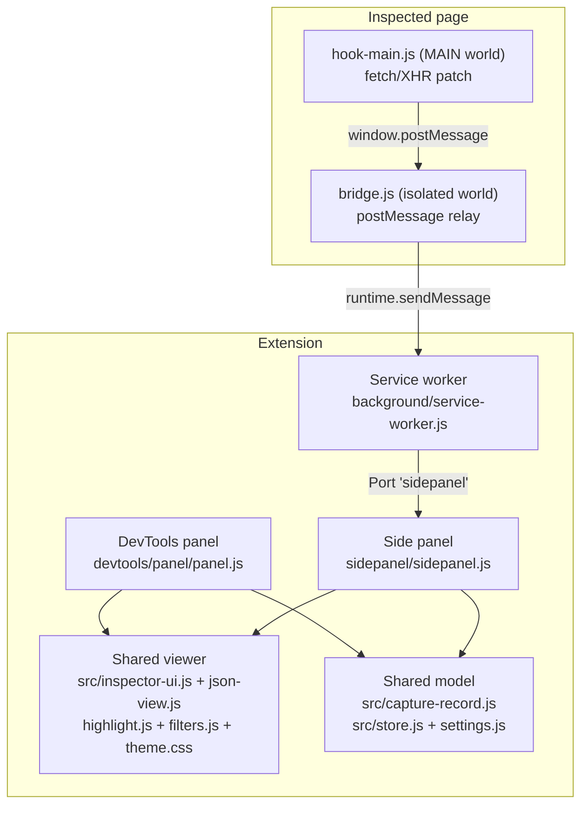
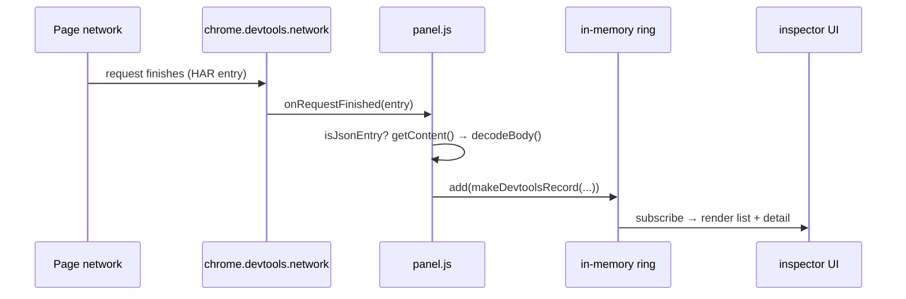
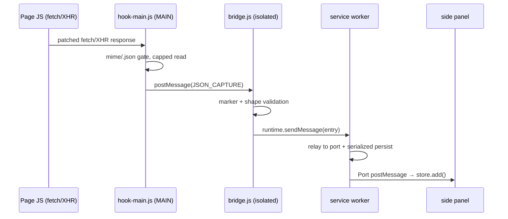

# Architecture

Two independent capture pipelines feed one shared viewer. The pipelines never
talk to each other and there is no cross-surface dedupe: the DevTools panel
shows `source: "devtools"` entries, the side panel shows `source: "page-hook"`
entries, each with a source badge in the header.

## Component map

## Pipeline A — DevTools (full fidelity)

- Runs only while DevTools is open; the panel owns its buffer and never
  touches the worker for capture.
- Request bodies come from HAR `postData`; response bodies from `getContent()`.
- Covers everything DevTools sees: fetch, XHR, WebSocket, SSE, document loads.

## Pipeline B — page hook (always on)

- Opt-in per tab: the side panel's **Enable capture** button → worker requests
  host permission on the click gesture → injects hook + bridge into all frames.
- The worker keeps per-tab buffers in `chrome.storage.session` so entries
  survive worker restarts and side-panel reconnects.
- Covers fetch/XHR only — never WebSocket, SSE, or navigation loads. The side
  panel says so in a permanent hint bar.

## Storage split

| Data | Where | Lifetime |
|------|-------|----------|
| User settings (`settings` key) | `chrome.storage.local` | persists across restarts |
| Per-tab buffers (`buf:<tabId>`), enable flags (`capture:<tabId>`) | `chrome.storage.session` | memory-only; cleared on disable/reload/update/browser restart |
| Panel list (DevTools surface) | in-memory `createStore` | dies with DevTools |
| Side-panel list | in-memory `createStore` | rebuilt from worker buffer on tab switch/reconnect |

The worker holds **no data** in module globals — only live `Port` objects and
in-flight promise chains (coordination, re-established from storage per event).

## Message protocol (worker)

| Type | Direction | Purpose |
|------|-----------|---------|
| `JSON_CAPTURE` | bridge → worker → panel port | one captured entry |
| `REQUEST_CAPTURE_ENABLE` | side panel → worker | permission request + inject; replies `{ granted, enabled, partial? }` |
| `REQUEST_CAPTURE_DISABLE` | side panel → worker | set `__jsonInspectorEnabled=false`, clear flag |
| `GET_CAPTURE_STATE` | side panel → worker | replies `{ enabled, hasAccess }` |
| `GET_BUFFER` | side panel → worker | replies `{ entries }` for a tab |
| `CLEAR_BUFFER` | side panel → worker | wipe a tab's buffer + badge |
| `PORT_INIT` / `PORT_SWITCH_TAB` | side panel → worker (port) | bind the port to a tab id |

---
*Verified against: `background/service-worker.js`, `content/hook-main.js`,
`content/bridge.js`, `devtools/panel/panel.js`, `sidepanel/sidepanel.js`,
`src/store.js`, `src/settings.js`.*
