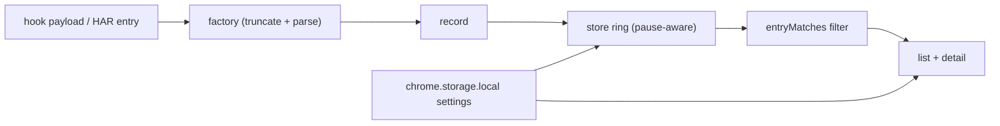

# Data Model, Store & Settings

Pure modules with no `chrome.*` imports (settings touches `chrome.storage`
only defensively) — safe to unit-test in Node.

## Record shape

Both factories in `src/capture-record.js` produce the same unit:

```text
{ id, url, method, status, statusText, mimeType,
  timeMs, startedAt (ISO), tabId,
  reqHeaders, resHeaders,                    // plain objects
  reqBody, reqBodyTruncated, reqBodySize, reqBodyMime,
  bodyText, truncated, originalSize, unparseable,
  source: 'devtools' | 'page-hook' }
```

- `id`: `makeId()` → `` r${Date.now().toString(36)}-${idCounter} ``.
- `makeDevtoolsRecord({ entry, bodyText, tabId })` maps the HAR entry:
  URL/method (upper-cased), `response.status`/`statusText`/`content.mimeType`,
  `Math.round(entry.time)`, `startedDatetime`, HAR header arrays folded
  last-wins, request payload from `request.postData.text`/`mimeType`.
- `makePageHookRecord(payload)` carries the hook fields through, defaulting
  missing headers to `{}` and non-string `reqBodyMime` to `''`.
- `unparseable` is `true` when non-empty text fails `JSON.parse` — the UI
  then shows raw text with a banner. `parseSafe` never throws.

## Size caps (single table)

| Constant | Value | Effect |
|----------|-------|--------|
| `MAX_BODY_CHARS` | 2 MB | response truncation point; `truncated: true`, `originalSize` kept |
| `REQ_BODY_CAP` | 256 KB | request-payload truncation point; same flag pattern |
| `MAX_FORWARD_CHARS` | 8 MB | above this, bodies are dropped (not truncated) to avoid OOM |

`truncateBody`/`truncateReqBody` return `{ text, truncated, originalSize }`.

## JSON detection & formatting helpers

- `isJsonEntry({ mimeType, url, accept })`: MIME contains `json`, URL path
  ends `.json` (query-tolerant, malformed-URL-tolerant), or Accept contains
  `json`.
- `headersToObject`: HAR `[{name, value}]` → object, last value wins, junk
  ignored.
- `statusClass`: `2xx`/`3xx`/`4xx`/`5xx`, anything else (including 0) →
  `'other'`.
- `formatSize` (`B` / `x.x KB` / `x.xx MB`), `formatTime` (`ms` / `x.xx s`),
  `displayPath` (path+query+hash, full URL kept for `title` tooltips).

## Store (`src/store.js`)

`createStore({ maxEntries })` — in-memory ring + filter state + pub/sub:
- `setFilters`/`getFilters` (`{ query, method, status }`), `getAll` (insertion-order copy), `getById`,
  `count`, `clear`, `subscribe`/`unsubscribe`.
- `add` pushes and sheds oldest past `maxEntries`; while **paused** it drops
  the entry, bumps `missedWhilePaused`, and emits `{ kind: 'missed' }` so the
  toolbar can report honestly. Resume resets the counter.
- `setMaxEntries` clamps to **50–2000**, sheds oldest immediately, ignores
  non-finite input (returns current limit).
- `handleNavigation` clears unless preserve-log is on, returning whether it
  cleared.
- `setFilters`/`getFilters` (`{ query, method, statusClass… }` — actually
  `{ query, method, status }`), `getAll` (insertion-order copy), `getById`,
  `count`, `clear`, `subscribe`/`unsubscribe`.
- A throwing listener is caught and warned — one bad subscriber never breaks
  the store.
- `getFiltered()` is **legacy** (kept for compatibility): the inspector
  filters exclusively via `entryMatches` over `getAll()`, so the visible list
  is exactly what the count label describes.

## Settings (`src/settings.js`)

- Persisted in `chrome.storage.local` under key `settings`; defaults
  `{ theme: 'system', prettyDefault: true, preserveLog: false, maxEntries: 500 }`.
- `loadSettings` merges stored over defaults (in-memory defaults when storage
  is unavailable); `saveSettings` merges partial over current.
- `onSettingsChanged` broadcasts `local` changes so both surfaces stay in
  sync (theme toggle propagates without reload).
- `resolveTheme`: explicit `light`/`dark` win; `system` resolves via
  `matchMedia('(prefers-color-scheme: dark)')`; `applyTheme` writes
  `document.documentElement.dataset.theme`.
- Note: `prettyDefault` is stored but has no UI toggle yet — harmless; wire
  or remove if the settings surface is ever touched.



---
*Verified against: `src/capture-record.js` (shape, factories, caps, helpers),
`src/store.js` (ring, pause, clamps, navigation, subscribe safety),
`src/settings.js` (key, defaults, merge, broadcast, theme resolution).
Covered by `test/capture-record.test.js` (13 tests) and `test/store.test.js`
(9 tests).*
