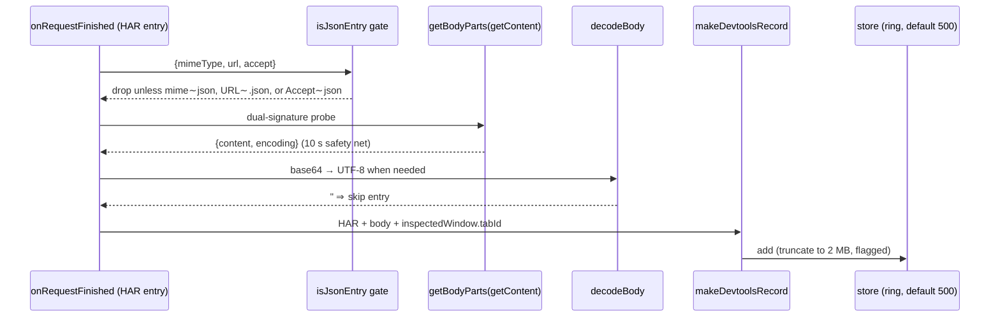

# DevTools Panel (primary capture)

Full-fidelity capture via `chrome.devtools.network`. Lives in
`devtools/` + `devtools/panel/`. The panel context dies with DevTools, so it
keeps its **own in-memory buffer** and never depends on the worker for capture
(the worker is touched only indirectly, through shared settings).

## Registration

`devtools/devtools.html` loads `devtools/devtools.js`, whose only job is:

```js
chrome.devtools.panels.create('JSON', '', 'devtools/panel/panel.html', …)
```

The panel path is relative to the **extension root**, not to `devtools/`.

## Request flow



## Behaviors worth knowing

- **JSON gate** (`isJsonEntry` in `src/capture-record.js`): response
  `content.mimeType` contains `json` (covers `application/problem+json`),
  or the URL path ends `.json`, or the request `Accept` header contains
  `json`. Everything else is ignored before any body fetch.
- **Dual-signature `getContent()`** (`getBodyParts`): Chrome 151+ resolves a
  Promise of `{ content, encoding }`; older Chrome uses the callback form.
  The code probes the return value (thenable → string → callback fallback),
  tolerates legacy shapes, and resolves `''` after a 10 s safety timeout so
  an entry can never hang the pipeline.
- **Base64 bodies** (`decodeBody`): non-textual transfers arrive base64; they
  are decoded to UTF-8 (`fatal: false`). Undecodable payloads resolve to `''`
  and the entry is skipped — never thrown.
- **Size policy**: bodies over `MAX_FORWARD_CHARS` (8 MB) are dropped to
  protect the renderer; everything under that is truncated to
  `MAX_BODY_CHARS` (2 MB) with `truncated: true` + `originalSize` preserved.
- **Request bodies** come from HAR `entry.request.postData` (`text` +
  `mimeType`), re-capped at 256 KB by `truncateReqBody`, and render in the
  **Request** tab.
- **Record fields** (`makeDevtoolsRecord`): method upper-cased, `time`
  rounded to `timeMs`, `startedDatetime` kept as ISO, headers folded from HAR
  `[{name, value}]` arrays last-wins, `tabId` from
  `chrome.devtools.inspectedWindow.tabId`, `source: 'devtools'`.
- **Navigation** (`onNavigated` → `store.handleNavigation()`): clears the list
  unless preserve-log is on.
- **Settings**: on load, applies `preserveLog` and clamped `maxEntries` from
  `chrome.storage.local`.
- **Theme**: when the user's theme setting is `system`, the panel follows
  DevTools instead of the OS — `panels.themeName` (`'default'` light or
  `'dark'`) applied immediately plus `setThemeChangeHandler` for live
  switches. Otherwise a dark DevTools would get a blinding light panel.

## Coverage vs. the page hook

The DevTools surface sees everything the Network tab sees — fetch, XHR,
WebSocket, SSE, document loads. The page hook sees fetch/XHR only. That is
why both surfaces exist with no dedupe between them.

---
*Verified against: `devtools/devtools.js`, `devtools/devtools.html`,
`devtools/panel/panel.html`, `devtools/panel/panel.js`,
`src/capture-record.js` (`isJsonEntry`, `decodeBody`, `truncateBody`,
`makeDevtoolsRecord`, caps), `src/store.js`. External: `getContent()`
Promise form Chrome 151+ and `themeName`/`setThemeChangeHandler` per
<https://developer.chrome.com/docs/extensions/reference/api/devtools/network>
and <https://developer.chrome.com/docs/extensions/reference/api/devtools/panels>.*
