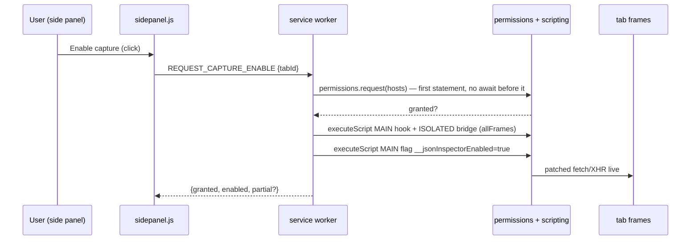

# Page Hook (always-on capture)

Opt-in fetch/XHR observation that works with DevTools closed. Two files,
two worlds, injected programmatically by the worker after the user enables
capture on a tab:

| File | World | May touch |
|------|-------|-----------|
| `content/hook-main.js` | `MAIN` (page context) | page globals (`fetch`, `XMLHttpRequest`); **never `chrome.*`** |
| `content/bridge.js` | `ISOLATED` | `chrome.runtime.sendMessage`; never page JS internals |

## Enable / disable flow

- The gesture rule is structural: `chrome.permissions.request()` is the first
  statement in the `REQUEST_CAPTURE_ENABLE` branch — any `await` before it
  burns the gesture and the call throws.
- Injection targets **all frames** so iframe traffic is captured; frames that
  refuse (e.g. `about:blank`, racing navigations) fall back to top-frame-only
  and the side panel reports `partial` (“top frame only — some subframes
  refused injection”).
- Re-injection is idempotent: a present hook only flips
  `__jsonInspectorEnabled` back to `true` and returns.
- **Disable** sets `__jsonInspectorEnabled = false` in all frames and clears
  the worker flag. **Navigation** wipes MAIN-world patches; the worker
  re-injects on `tabs.onUpdated(status === 'complete')` when the tab is still
  enabled and host access persists.

## What the hook observes

- **fetch**: string URLs and `Request` objects (method taken from the object,
  overridden by `init.method`). Init-string bodies are captured synchronously;
  `Request`-object bodies are clone-read **before dispatch** — after `fetch`
  consumes the original, `clone()` throws and the body is lost, so the read
  starts up front and the emit is gated on it (5 s bound, then give up).
  Responses are `clone()`d; a missing body stream (204/304) or empty text is
  skipped as noise.
- **XHR**: `open()` stashes method/URL; `send()` captures string bodies and
  attaches a `load` listener. `responseText` is used for `''`/`text` types;
  `json`-type responses are re-serialized; `blob`/`arraybuffer`/`document`
  are skipped.
- **JSON gate**: forward only when the response MIME contains `json` or the
  URL path ends `.json` — same predicate family as the DevTools surface.
- **Never breaks the page**: every observation point is wrapped in
  try/catch; originals are always invoked with the original arguments; on any
  setup failure the wrapper returns the pristine traffic untouched.

## Memory and size bounds

| Bound | Value | Where |
|-------|-------|-------|
| Response read cap | 8 MB (`MAX_FORWARD_CHARS`) | explicit reader; overflow resolves with the capped prefix |
| Response hard drop | > 8 MB | XHR path returns; panel path returns |
| Bridge forward bound | 2 MB + 1 KB (`MAX_BODY_CHARS + 1024`) | oversized `bodyText` rejected |
| Record truncation | 2 MB, flagged, `originalSize` kept | `truncateBody` in `makePageHookRecord` |
| Request bodies | 256 KB, flagged (`REQ_BODY_CAP`) | init string / Request clone / XHR `send` arg; string bodies only |
| Bridge spoof bound | 257 KB (`REQ_BODY_CAP + 1024`) | oversized `reqBody` rejected |
| Response read timeout | 30 s (`READ_TIMEOUT_MS`) | reader cancelled on timeout |
| Request-body read timeout | 5 s | `readRequestBody` always resolves |

Streams are read through an explicit `getReader()` loop with `TextDecoder`
(`fatal: false`), and the reader is **cancelled** on cap, timeout, or error —
a never-ending JSON stream cannot grow page memory through the tee.

## Bridge validation (`isValidPayload` + `isValidHookPayload`)

The isolated bridge accepts a `message` event only when **all** hold:
`event.source === window`, `data.type === 'JSON_CAPTURE'`,
`data.source === 'json-network-inspector'` marker, non-empty string `url`,
non-empty string `bodyText` within the forward bound, and (if present) a
string `reqBody` within the spoof bound. Failures are dropped silently;
`sendMessage` is fire-and-forget. The side panel re-validates with
`isValidHookPayload` before records are built.

## Known limits (by design)

- fetch/XHR only — no WebSocket, SSE, navigation, or document JSON. The side
  panel carries a permanent hint pointing at the DevTools → JSON tab.
- Non-string request bodies (FormData, Blobs, streams) are not read; uploads
  stay untouched.
- Page scripts run first: a hostile page could spoof display-only entries —
  see `security-privacy.md`. All rendering is `textContent`-only, so spoofed
  entries cannot execute markup.

---
*Verified against: `content/hook-main.js` (flags, caps, fetch/XHR wrappers,
`readCapped`, `readRequestBody`), `content/bridge.js` (marker, validation),
`background/service-worker.js` (`injectHook`, enable/disable branches,
`onUpdated` re-inject), `sidepanel/sidepanel.js` (enable flow, partial
notice, hint text), `src/capture-record.js` (`isValidHookPayload`,
`truncateReqBody`, `makePageHookRecord`). Live browser tests confirmed POST
bodies on all three paths, 3.2 MB forwarding, and intact page traffic.*
