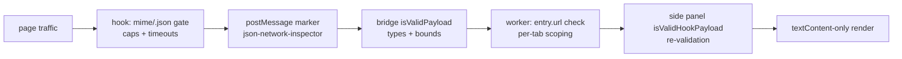

# Security & Privacy

## Privacy posture: local-only

- The extension makes **no network calls of its own**: no analytics, no
  backend, no sync, no accounts. The only traffic it reads is the page's own,
  already in the browser.
- Captured bodies live in memory (`store` rings), per-tab worker buffers in
  `chrome.storage.session` (memory-only, cleared on disable/reload/update/
  browser restart), and settings in `chrome.storage.local`. Nothing leaves
  the device.
- Host access (`http/https */*`) is optional and requested only on the
  explicit Enable click, per tab; install-time footprint stays at four
  narrow permissions (see `manifest-permissions.md`).

## CSP compliance

- No `eval()` / `new Function()` anywhere in extension pages; no inline
  `<script>` and no inline event handlers in any HTML shell — all listeners
  via `addEventListener`, all scripts via `<script src>`.
- The MAIN-world hook is a plain file injected with `executeScript`
  (`files:`, never an inline string), which also avoids page-CSP friction.

## Validation layers (page → UI)

1. Hook gates on MIME/URL and bounds reads (8 MB reader cap, 30 s timeout,
   256 KB request cap, string bodies only).
2. Bridge accepts only `event.source === window` + exact marker + shape/bounds
   (body ≤ 2 MB + 1 KB, `reqBody` ≤ 257 KB and string).
3. Worker checks `entry.url` is a string and scopes storage/relay by sender
   tab id.
4. Side panel re-validates every relayed and buffered payload before building
   records.
5. Rendering is `textContent`-only (tree, highlighter, rows, headers):
   hostile keys, URLs, and bodies cannot inject markup — covered by escaping
   tests.

## Spoofing analysis (residual risk, accepted)

Page scripts run in the same MAIN world and could `postMessage` a forged
`JSON_CAPTURE` entry with the right marker. Impact is bounded **by
construction**: forged entries are display-only rows in the inspector — no
code path evaluates, navigates to, or fetches entry content, and rendering
cannot execute markup. There is no credential, sync, or exfiltration surface
for a forgery to reach. If the threat model ever grows (e.g. cloud sync of
captures), entries must be re-authenticated at the bridge (e.g. signed
frame tokens) before that work begins.

## Permissions hygiene

- `tabs` is read-only (`get`/`query`/events) for labels and tab-follow.
- `scripting` executes only the two bundled files plus a one-line enable
  flag — no dynamic code strings.
- No `cookies`, `webRequest`, `declarativeNetRequest`, or broad host access
  at install.

---
*Verified against: `content/hook-main.js` (no `chrome.*`, try/catch
discipline), `content/bridge.js` (marker + bounds), `src/*.js` (no `eval` /
`innerHTML` on untrusted input — highlighter/tree use `textContent`),
`*.html` (no inline scripts/handlers), `manifest.json` (permission set),
`background/service-worker.js` (session/local split, tab scoping).*
