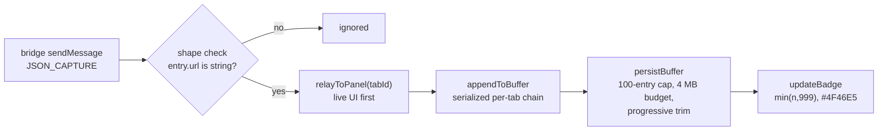

# Service Worker

`background/service-worker.js` — ephemeral coordinator. Chrome may terminate
it at any time, so **no capture data or settings live in module globals**.
The only module state is `livePorts` (live `Port` objects) and
`bufferChains` (in-flight per-tab promise chains) — coordination handles that
are re-established from storage on the next event.

## Entry pipeline

- **Relay first, persist second**: `handleCapture` posts to matching panel
  ports before awaiting storage, keeping live UI snappy.
- **Race-free appends**: concurrent captures otherwise read-modify-write the
  same stored list and silently lose entries. `appendToBuffer` chains one
  promise per tab (`prev.then(inner, inner)` so a failure never stalls the
  chain) and deletes the chain entry when it settles.
- **Progressive-trim persist**: each list is capped at `BUFFER_LIMIT` (100)
  entries, then `persistBuffer` sheds oldest-first (quarters while over the
  ~4 MB `BUFFER_BYTE_BUDGET`, halves on quota errors, up to 6 attempts). If
  nothing can be stored it returns `null` and storage keeps its previous good
  state instead of freezing on a stale write. Size is estimated as
  `bodyText + url + reqBody + 512` bytes per entry.
- **Badge**: `chrome.action.setBadgeText({ tabId, text })` shows the buffered
  count capped at 999 (empty when zero); background `#4F46E5`. Badge is
  cosmetic — failures are swallowed (the tab may be gone).

## Ports (live relay to the side panel)

- `onConnect` accepts only `name === 'sidepanel'` and tracks
  `{ port, tabId }`; `onDisconnect` removes the entry.
- `PORT_INIT` / `PORT_SWITCH_TAB` bind a port to a tab id. The side panel
  **re-announces on every (re)connect** because a worker restart wipes the
  worker-side mapping — without that, live relay goes silent after a restart.
- Relay is tab-scoped worker-side; dead ports are skipped (cleanup happens on
  disconnect).

## Tab lifecycle

- `tabs.onRemoved`: removes `buf:<tabId>` and `capture:<tabId>` keys and
  drops the tab's chain.
- `tabs.onUpdated` (`status === 'complete'`): re-injects the hook when the
  tab is still enabled **and** host access persists; restricted pages
  (`chrome://`, Web Store) reject injection and are ignored.
- `onInstalled`: calls `chrome.sidePanel.setPanelBehavior({
  openPanelOnActionClick: true })` (exact property — the `...IconClick`
  variant throws synchronously and kills the worker) and seeds default
  settings on first install: `{ theme: 'system', prettyDefault: true,
  preserveLog: false, maxEntries: 500 }`.

## Message branches (`onMessage`)

Async branches use IIFE + `return true` uniformly, except the
fire-and-forget `JSON_CAPTURE` capture (returns `false`). The one structural
exception: `REQUEST_CAPTURE_ENABLE` calls `chrome.permissions.request()`
**synchronously first, with no `await` before it** — the user gesture from
the side panel survives exactly one synchronous turn.

| Incoming | Work | Reply |
|----------|------|-------|
| `JSON_CAPTURE` | validate `entry.url`, relay + persist | none |
| `REQUEST_CAPTURE_ENABLE` | permission → `injectHook` → set `capture:<tabId>` | `{ granted, enabled, partial?, error? }` |
| `REQUEST_CAPTURE_DISABLE` | MAIN-world `__jsonInspectorEnabled=false` (all frames), clear flag | `{ ok: true }` |
| `GET_CAPTURE_STATE` | read flag + `permissions.contains(hosts)` | `{ enabled, hasAccess }` |
| `GET_BUFFER` | read `buf:<tabId>` | `{ entries }` (array or `[]`) |
| `CLEAR_BUFFER` | write `[]`, reset badge | `{ ok: true }` |

All storage access funnels through `readSession` (warns and returns `{}` on
failure); flag writes through `writeSessionFlag`.

---
*Verified against: `background/service-worker.js` (constants, `persistBuffer`,
`appendToBuffer`, `relayToPanel`, `handleCapture`, `updateBadge`, port
handlers, tab lifecycle, install handler, all six message branches).*
